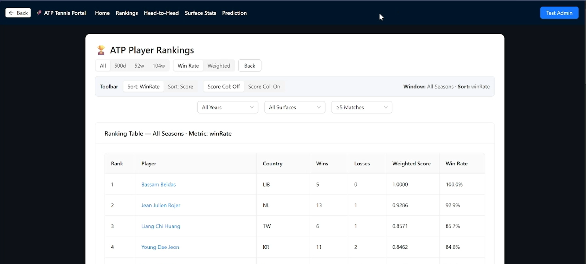
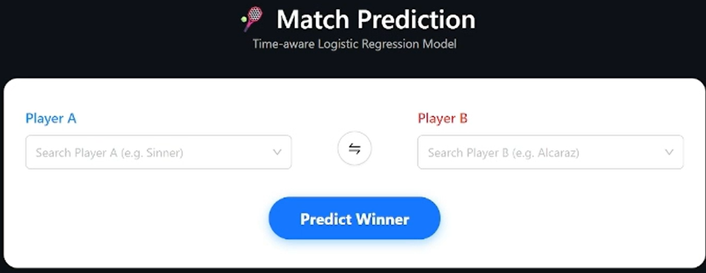

# ATP Tennis Data Portal

> A full-stack, time-aware, and interpretable tennis analytics platform for ATP match data, player ranking analysis, and match outcome prediction.

<p align="center">
  
  
  
  
  
  
</p>

---

## Table of Contents

- [Overview](#overview)
- [Why This Project](#why-this-project)
- [Key Features](#key-features)
- [Tech Stack](#tech-stack)
- [Architecture](#architecture)
- [Project Structure](#project-structure)
- [Model Workflow](#model-workflow)
- [Ranking API Examples](#ranking-api-examples)
- [Quick Start](#quick-start)
- [Screenshots](#screenshots)
- [Research Focus](#research-focus)
- [Roadmap](#roadmap)
- [Contributing](#contributing)
- [Author](#author)
- [License](#license)

---

## Overview

**ATP Tennis Data Portal** is a full-stack analytics and prediction platform built around historical ATP tennis match data.

The project combines:

- player ranking analysis
- dynamic performance comparison
- time-aware feature engineering
- interpretable match outcome prediction
- API-based backend services for data access and model inference

This project is designed to balance two goals:

1. **Interpretability** — predictions should be explainable through transparent features and understandable logic
2. **Temporal awareness** — recent matches can matter more than distant history when appropriate

Unlike many sports analytics projects that only present static summaries or black-box outputs, this portal focuses on producing results that are both practical for deployment and meaningful for research.

---

## Why This Project

Traditional ranking systems and match prediction models often treat historical performance as static. In reality, tennis players’ form changes over time due to momentum, injuries, surface adaptation, and recent competitive activity.

This project explores a more realistic and research-oriented framework through:

- configurable historical windows
- weighted ranking strategies
- bonus-based ranking logic
- optional exponential time-decay experiments
- lightweight, interpretable predictive modelling

The aim is not only to improve performance, but also to create a system that is:

- easy to explain
- easy to evaluate
- easy to integrate into a web application
- easy to extend for future research

---

## Key Features

### 1. Player Ranking Analysis

- Classic win-rate rankings
- Weighted performance rankings
- Dynamic rankings over configurable time windows
- Bonus-based ranking variants
- Optional time-decay extensions for recent-form emphasis

### 2. Match Outcome Prediction

- Logistic regression based match prediction
- Interpretable engineered input features
- Structured comparison of recent form and historical performance
- Lightweight production inference using exported model parameters

### 3. Full-Stack Web Integration

- React-based frontend portal
- Node.js / Express backend APIs
- Production prediction service using exported coefficients
- Clear separation between offline training and live inference

### 4. Research-Oriented Design

- Baseline vs time-aware model comparison
- Transparent feature construction
- Explainable modelling workflow
- Extendable architecture for future analytics and prediction research

---

## Tech Stack

### Frontend

- React
- JavaScript / TypeScript
- Dashboard-oriented user interface

### Backend

- Node.js
- Express.js
- REST API services

### Data Science / Modelling

- R
- Logistic Regression
- Time-decay feature engineering
- Structured statistical feature extraction

### Data Source

- Historical ATP tennis match datasets

---

## Architecture

The platform is designed with a clear separation between **data modelling** and **production delivery**.

```text
Historical ATP Data
        │
        ▼
Data Processing / Feature Engineering (R)
        │
        ▼
Model Training and Evaluation (R)
        │
        ▼
Export Model Parameters (JSON)
        │
        ▼
Backend API Inference (Node.js / Express)
        │
        ▼
Frontend Dashboard / Prediction Display (React)
```
This architecture keeps production lightweight while preserving a research-focused training workflow.

---
## Project Structure

```text
atp-tennis-portal/
├─ frontend/                        # React frontend application
├─ backend/                         # Node.js / Express backend APIs
├─ datasets/                        # ATP datasets and analysis resources
│  ├─ tennis_atp/
│  └─ analysis/
├─ models/                          # Exported model files / trained parameters
├─ scripts/                         # Data processing and modelling scripts
├─ outputs/                         # Generated figures / evaluation results
├─ docs/                            # Additional project documentation
├─ .gitignore
├─ CONTRIBUTING.md
├─ LICENSE
└─ README.md
```
## Model Workflow

A core implementation principle of this project is the explicit separation between **training** and **production inference**.

### Training Environment

The predictive model is developed in **R**, where the project performs:

- feature engineering
- logistic regression training
- model evaluation
- coefficient extraction
- parameter export

### Production Environment

The deployed web application does **not** execute R model training directly.

Instead:

- trained coefficients are exported into a structured file such as JSON
- the backend loads these parameters at startup
- Node.js performs logistic regression inference directly in production
- the frontend displays the prediction result to the user

### Key Principle

**R is used for training the model, while Node.js performs prediction using exported parameters.**

This design makes the system:

- lighter in production
- easier to deploy
- easier to explain
- easier to reproduce across environments

### Dynamic Ranking (52 weeks)

### Classic Ranking

```text
/api/players/rankings/dynamic?minMatches=5&limit=50&weeks=52&sortBy=winRate&algo=classic
```

### Weighted Dynamic Ranking

```text
/api/players/rankings/dynamic?minMatches=5&limit=50&weeks=52&sortBy=weighted&algo=classic
```

### Bonus-Based Weighted Ranking

```text
/api/players/rankings/dynamic?minMatches=5&limit=50&weeks=52&bonus=true&sortBy=weighted&algo=classic
```

### Time-Decay Experiment Examples

```text
/api/players/rankings/dynamic?minMatches=5&limit=50&weeks=52&decay=true&lambda=0.4&sortBy=weighted&algo=classic
/api/players/rankings/dynamic?minMatches=5&limit=50&weeks=52&decay=true&lambda=0.8&sortBy=weighted&algo=classic
/api/players/rankings/dynamic?minMatches=5&limit=50&weeks=104&decay=true&lambda=0.8&sortBy=weighted&algo=classic
```

## Quick Start

### 1. Clone the repository

```bash
git clone https://github.com/your-username/atp-tennis-portal.git
cd atp-tennis-portal
```

### 2. Install frontend dependencies

```bash
cd frontend
npm install
```

### 3. Install backend dependencies

```bash
cd ../backend
npm install
```

### 4. Start the backend

```bash
npm run dev
```

### 5. Start the frontend

```bash
cd ../frontend
npm run dev
```

### 6. Run the model export workflow

```bash
Rscript export_model.R
```

## Screenshots

### Ranking Dashboard


### Match Prediction Page


---

## Research Focus

This project is also designed as a research-oriented exploration of:

- interpretable sports analytics
- time-aware predictive modelling
- dynamic player evaluation
- production integration of statistical models
- lightweight prediction systems

The longer-term direction is to move from a tennis-specific prototype toward a broader theoretical framework for competitive event data analysis across sports.

---

## Roadmap

- [ ] Add more polished frontend visualisations
- [ ] Expand player comparison tools
- [ ] Improve surface-specific modelling
- [ ] Add Elo-based comparison modules
- [ ] Strengthen time-decay evaluation experiments
- [ ] Improve model explanation outputs
- [ ] Add detailed dataset preparation documentation
- [ ] Generalise the framework for cross-sport analytics

---

## Contributing

Contributions are welcome.

Please read [CONTRIBUTING.md](./CONTRIBUTING.md) before opening an issue or pull request.

---

## Author

**Linhan Yue**  
Student ID: 5177547  
BSc Computer Science  
Teesside University

---

## License

This project is released under the [MIT License](./LICENSE).
